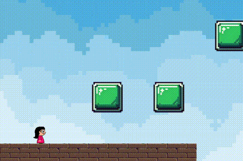

# platformer-game-sdl
This is a simple 2D Platformer game made using sdl2 and c++.  

# Platformer Game (SDL2 + ECS)

A simple 2D platformer built using [SDL2](https://www.libsdl.org/) in C++, featuring a custom Entity-Component-System (ECS), basic animation support, and two kinds of collision detection (AABB and per-tile collision). This project serves as a foundation for learning low-level game engine concepts and building modular systems in C++.

 <!-- Replace with actual image path if available -->

---

## 🔧 Built With

- **C++17**
- **SDL2** — for rendering, input, window management
- **SDL_image** — for loading textures
- **Custom ECS** — lightweight and minimal
- **Tiled Map Editor (.tmx)** — for level design (via XML parsing)

---

## ✨ Features

- ⚙️ Custom **Entity-Component-System** (ECS) architecture
- 🎮 **Player movement**, jumping, and gravity physics
- 🧱 **Collision detection**:
  - Axis-Aligned Bounding Box (AABB)
  - Tile-based (map collision from Tiled)
- 🧍 **Animation system** (frame-based, loopable)
- 🗺️ Load tilemaps via Tiled `.tmx` files (XML parser included)
- 🧪 Debug-friendly architecture (logging, separation of systems)

---

## 📁 Project Structure

